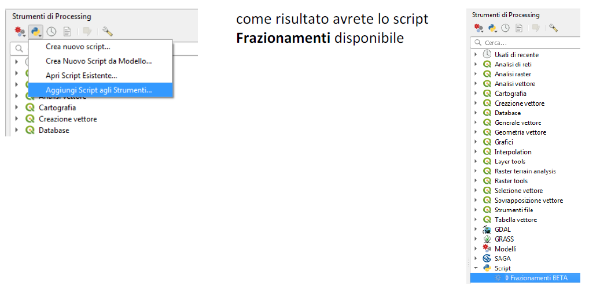
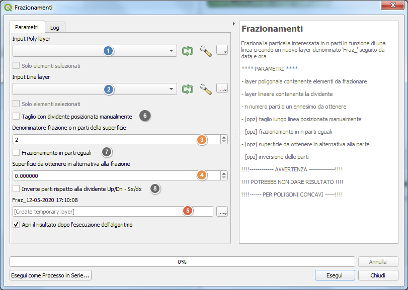
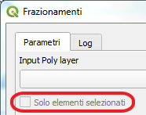
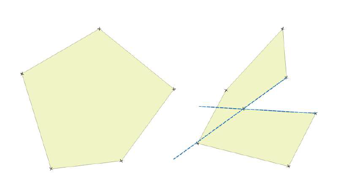

# Frazionamenti

## PROCESSING PER FRAZIONAMENTI
Il frazionamento (catastale) è una procedura con la quale si mira a dividere in più unità un terreno in generale quindi una particella catastale.
Esiste una casistica e relative modalità per frazionare una particella con procedimenti geometrici e matematici.
In questa applicazione il frazionamento viene eseguito con algoritmi di bisezione applicati alla superficie che si intende dividere.

## Caricamento algoritmo di processing
	
Da **Strumenti di Processing** eseguire **Aggiungi Script agli Strumenti**

## Finestra dell’algoritmo

Descrizione parametri:

1. [**richiesto**] layer poligonale su cui scegliere la/e particelle da frazionare
2. [**richiesto**]  layer linea su cui disegnare la linea di taglio desiderata
3. [**richiesto** alternativo a 4] Denominatore della frazione di superficie da ottenere (ad esempio 1/3) o in alternativa il numero di parti eguali in cui dividere la particella/poligono
4. [**richiesto** alternativo a 3] In alternativa al numero di parti è possibile specificare l’area che si vuole ottenere come area di risultato. 
L’inserimento di una superficie target fa ignorare il parametro del punto 3
5. [**opzionale**] Di default l’algoritmo produce un layer temporaneo che ha per nome ‘Fraz_’ seguito da data e ora, che dovrete salvare una volta raggiunto il risultato voluto
6. [**opzionale**] Potrebbe essere necessario tagliare la particella con una linea vincolata (ad esempio una strada in progetto con la sua larghezza) in tal caso spuntando la casella verrà eseguito un taglio direttamente con la dividente indicata
7. [**opzionale**] Spuntare se si vogliono n parti della medesima superficie (ovviamente per n maggiore di 2) 
8. [**opzionale**] Poiché la ricerca della posizione della dividente secondo i parametri impostati dipende da come è posizionato il centroide della geometria poligonale, potrebbe ottenersi, nel caso di divisione per frazione (ad esempio 1/3) o nel caso di superficie assegnata, la parte risultante nella posizione non desiderata, spuntando è possibile invertire la posizione rispetto alla dividente.

Parametri avanzati

E' possibile variare la precisione del risultato che per default è impostata alla terza cifra decimale.

E' anche possibile variare il numero di iterazioni massime che l'algoritmo di bisezione compie nella ricerca del risultato, variazioni di questo parametro non dovrebbero servire.

## Modalità operative
	
Caricati i layer e tracciata la linea è possibile selezionando una particella ottenerne il frazionamento eseguendo lo script e spuntando, nel caso di un layer con più poligoni, “solo elementi selezionati”.

Nel caso di più particelle occorre attivare anche la modalità ricorsiva.

La linea di divisione può essere tracciata in un punto qualsiasi del layer e può altresì essere di qualsiasi lunghezza, provvederà l’algoritmo a considerarla opportunamente.
I layer devono essere proiettati e possono anche essere temporanei.
L’algoritmo accetta layer di tipo qualunque.

## AVVERTENZA

Ricordato che un poligono viene detto concavo se il prolungamento di uno dei suoi lati lo divide in due parti, mentre viene detto convesso se questo non accade per nessun lato.

L’algoritmo converge normalmente se il poligono è convesso, nel caso di poligoni concavi dipende dall’orientamento della dividente.

## Esempi

<!---
your comment goes here
and here

Frazionamento in parti eguali

-->

Frazionamento incrociato in parti eguali

Frazionamento in parti complementari o direttamente da dividente

Frazionamento a superficie vincolata

